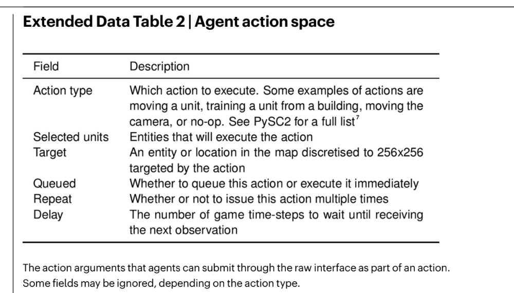
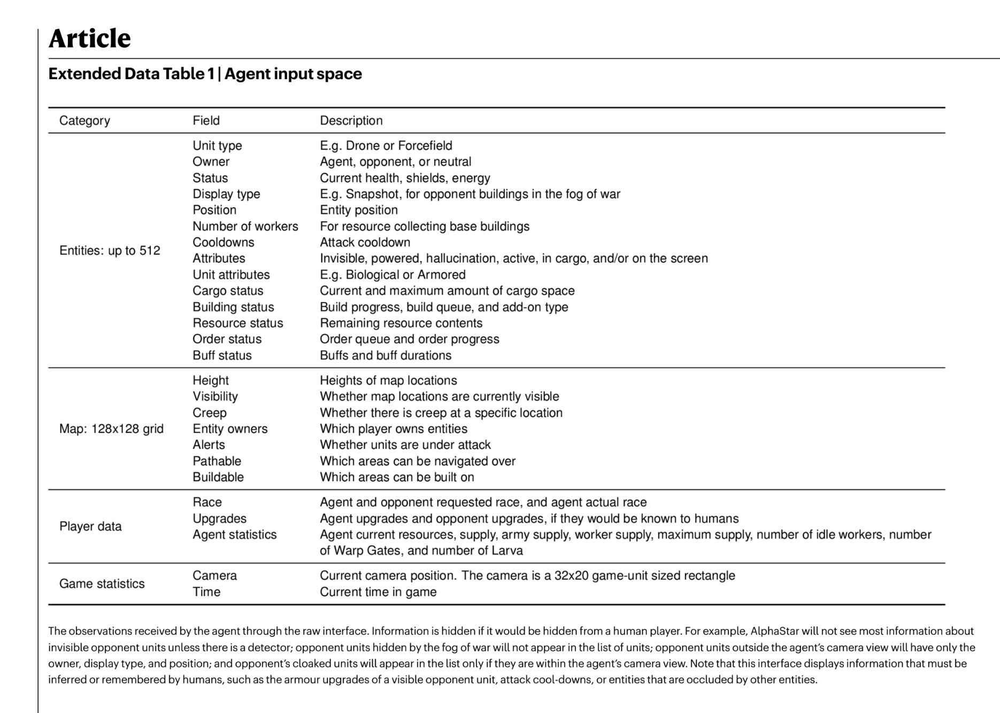

# References 

## Models 

* https://www.deepmind.com/blog/alphastar-mastering-the-real-time-strategy-game-starcraft-ii
* https://www.deepmind.com/blog/alphastar-grandmaster-level-in-starcraft-ii-using-multi-agent-reinforcement-learning
* Public repo that tries to imitate what alpha start did: https://github.com/kimbring2/AlphaStar_Implementation
* The public sc2 environment: https://github.com/deepmind/pysc2
* Corresponding paper: https://arxiv.org/abs/1708.04782
* StarCraft II DeepMind feature layer API: https://youtu.be/5iZlrBqDYPM
* Paper from nature: https://drive.google.com/file/d/1BzpiJykuMOC8XgN-DbMbrhSbvWEj2WTS/view?usp=sharing
* [Grandmaster level in StarCraft II using multi-agent reinforcement learning](./Grandmaster level in StarCraft II using multi-agent reinforcement learning.pdf)
* [starcraft_ii_unplugged_large_s](./starcraft_ii_unplugged_large_s,pdf)

* Prof. David Churchill who runs BW AI tournaments and does research on game AI: http://www.cs.mun.ca/~dchurchill/

## API 

* Deepmind pysc2 Actions and Observations: https://github.com/deepmind/pysc2/blob/master/docs/environment.md#actions-and-observations
* 
* 
